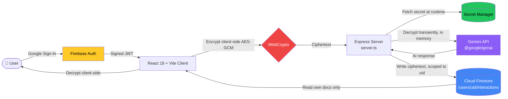

<div align="center">


<a href="#">
  
</a>

<br/>

[](https://ai.google.dev/)
[](https://firebase.google.com/)
[](https://cloud.google.com/run)
[](#-security-model)
[](#-license)


</div>

<br/>

<div align="center">

</div>

<br/>

> **ReflectAI** is a full-stack, authenticated journaling companion powered by **Google Gemini** and **Cloud Firestore** — built as a submission for the **Google AI Studio Ideathon (APAC GenAI Academy)**. Every line of code was written under a security-first "constitution": threat-modeled, access-controlled, secret-free, and now fully **end-to-end encrypted** by construction.

<br/>

## 📖 Table of Contents

<table>
<tr>
<td width="50%" valign="top">

- [✨ What is ReflectAI](#-what-is-reflectai)
- [🎬 Live Demo](#-live-demo)
- [🧠 Core Features](#-core-features)
- [🚀 Beyond the Base Spec](#-beyond-the-base-spec)
- [🏗️ Architecture](#️-architecture)

</td>
<td width="50%" valign="top">

- [🔐 Security Model](#-security-model)
- [🛠️ Tech Stack](#️-tech-stack)
- [🚀 Getting Started](#-getting-started)
- [☁️ Deploying to Cloud Run](#️-deploying-to-cloud-run)
- [🗂️ Project Structure](#️-project-structure)

</td>
</tr>
</table>

<br/>

## ✨ What is ReflectAI

ReflectAI gives every user a **private, encrypted, sandboxed** space to journal, brainstorm, and reflect in a live multi-turn conversation with Gemini. No two users ever share data — every document, every prompt, every AI response lives strictly under that user's own authenticated path in Firestore, and every entry is encrypted client-side before it's ever written.

It was built to prove a point: an AI-scaffolded app doesn't have to trade production-readiness for speed. Google AI Studio's Custom Instructions were configured *first*, as a standing "constitution," before a single feature was written — so threat modeling, access control, secret hygiene, and encryption-by-default were baked into generation, not patched on afterward.

<br/>

## 🎬 Live Demo

<div align="center">

**[🔗 Try the live app](https://ai.studio/apps/b4936274-7484-4af7-ae96-f5b1c5ce2969)**

</div>

<br/>

## 🧠 Core Features

<table>
<tr>
<td width="33%" valign="top">

### 🔑 Federated Auth
One-click **Google Sign-In** via Firebase Authentication. No passwords are ever collected, hashed, or stored — identity is fully delegated.

</td>
<td width="33%" valign="top">

### 💬 Multi-Turn Reflection
Real conversations with **Gemini 3.6 Flash**, across three modes — *Deep Reflect*, *Structured Summary*, and *Brainstorm & Ideas* — with automatic model fallback if a model is unavailable.

</td>
<td width="33%" valign="top">

### 🗄️ Isolated Persistence
Every entry is written to `/users/{userId}/interactions/{id}` in Firestore, enforced at the **rules layer** — not just in application logic.

</td>
</tr>
<tr>
<td width="33%" valign="top">

### 🔒 Zero Hardcoded Secrets
`GEMINI_API_KEY` is never committed or shipped client-side — it's retrieved from **Google Cloud Secret Manager** and injected at runtime into the Cloud Run service.

</td>
<td width="33%" valign="top">

### 🎨 Polished, Animated UI
Built with **Tailwind CSS 4** and **Framer Motion**, rendering Gemini's markdown responses natively via `react-markdown`.

</td>
<td width="33%" valign="top">

### 🛡️ Threat-Modeled by Design
Every feature was generated against a standing security "constitution" in AI Studio — OWASP Top 10 + OWASP LLM Top 10 aligned.

</td>
</tr>
</table>

<br/>

## 🚀 Beyond the Base Spec

The starter lab gets you a working AI journal. ReflectAI goes further, treating a journal's contents the way they deserve to be treated — as genuinely private.

<table>
<tr>
<td width="50%" valign="top">

### 🔐 Encrypted Insight Vault
Every entry is encrypted **client-side with AES-GCM** (WebCrypto) before it ever touches Firestore. Even a full database breach exposes only ciphertext. Gemini decrypts content transiently, in memory, only for the duration of a request — never logged, never cached, never written to disk.

</td>
<td width="50%" valign="top">

### 🧠 Memory & Pattern Engine
Weekly, Gemini-generated summaries surface recurring themes and mood shifts across your own entries. Keyword search works across your encrypted history, decrypting client-side. Every aggregation re-verifies per-entry ownership — a feature that "knows you" was built to never accidentally leak someone else's data.

</td>
</tr>
<tr>
<td width="50%" valign="top">

### 🛡️ Pre-Send PII Guard
A lightweight, non-blocking check flags likely emails or phone numbers in a draft before it's sent to Gemini, giving the user a clear "send anyway or edit first" choice rather than silently stripping or blocking content.

</td>
<td width="50%" valign="top">

### ⏱️ Session Freshness Checks
Sensitive actions (like exporting your data) require a fresh, re-verified auth token rather than trusting an arbitrarily old session — shrinking the window a hijacked session could be misused in.

</td>
</tr>
<tr>
<td width="50%" valign="top">

### 📤 Encrypted Data Export
A "Download my data" option decrypts entries **client-side only** into a local file. Decrypted content never passes through the server during export — reusing the same vetted decrypt path as the rest of the app.

</td>
<td width="50%" valign="top">

### 🚦 Per-User Rate Limiting
The Gemini proxy endpoint is rate-limited per authenticated `uid`, generous enough to never interrupt normal use, but enough to blunt abuse or runaway cost from a compromised session.

</td>
</tr>
<tr>
<td width="50%" valign="top">

### 🧯 Global Error Boundary
A single component failure can no longer take down the entire app. Errors are caught, logged safely (no journal content), and shown as a friendly recoverable screen instead of a blank crash.

</td>
<td width="50%" valign="top">

### ✨ Loading & Empty States
Every async interaction — auth checks, entry loads, Gemini responses, search — has a real loading and empty state, never a blank or broken-looking screen.

</td>
</tr>
</table>

<br/>

## 🏗️ Architecture



| Layer | Component | Security Control |
|---|---|---|
| **Authentication** | Firebase Authentication (Google Sign-In) | Federated identity only — no passwords stored |
| **Encryption** | WebCrypto AES-GCM (client-side) | Entries encrypted before write; decrypted only client-side or transiently server-side |
| **Data Storage** | Cloud Firestore | Isolated path: `/users/{userId}/interactions/{interactionId}`, ciphertext at rest |
| **AI Processing** | Express proxy + `@google/genai` | API key never reaches the client; model fallback ladder; per-user rate limiting |
| **Secret Management** | Google Cloud Secret Manager | Injected as env vars at Cloud Run runtime via IAM binding, never hardcoded |

<br/>

## 🔐 Security Model

<details>
<summary><b>Click to expand — Firestore Security Rules</b></summary>

```javascript
rules_version = '2';
service cloud.firestore {
  match /databases/{database}/documents {
    match /users/{userId}/interactions/{interactionId} {
      allow read, write: if request.auth != null && request.auth.uid == userId;
    }
  }
}
```

Deploy with:
```bash
firebase deploy --only firestore:rules
```

</details>

<details>
<summary><b>Click to expand — Client-Side Encryption (Encrypted Insight Vault)</b></summary>

- All entry text (prompt + Gemini response pairs) is encrypted client-side with **AES-GCM, 256-bit**, via the browser's native `SubtleCrypto` — before any Firestore write.
- The per-user encryption key is stored **separately** from the ciphertext, never in the same document, so a leaked entry document alone reveals nothing readable.
- When Gemini needs to read past entries (for the Pattern Engine's trend summaries), decryption happens **transiently, server-side, in memory only** — the plaintext is never logged, cached, or persisted to disk.
- Verified manually: inspecting a raw Firestore document shows genuine ciphertext (confirmed not to be base64-encoded plaintext), and Cloud Run logs contain no trace of decrypted journal content after normal use.

</details>

<details>
<summary><b>Click to expand — Aggregation & Pattern Engine Safety</b></summary>

- Any endpoint reading multiple entries for trend summaries or search re-verifies `request.auth.uid` ownership **per entry**, not just once at the top of the request.
- Aggregation calls are capped at a fixed number of entries per request, limiting the blast radius if a session were ever compromised.
- Generated trend summaries are treated as sensitive data and follow the same encryption-at-rest rule as individual entries.

</details>

<details>
<summary><b>Click to expand — Gemini Model Resilience (Fallback Ladder)</b></summary>

Every AI call is wrapped so a single model outage never breaks the app:

```
gemini-3.6-flash → gemini-3.1-flash-lite → gemini-flash-latest → gemini-3.7-flash
```

`429` / `500` / `503` responses are caught and retried down the ladder before an error ever reaches the user.

</details>

<details>
<summary><b>Click to expand — What "Zero Hardcoded Secrets" actually means here</b></summary>

- No API key, service account, or credential is ever committed to this repo.
- `GEMINI_API_KEY` and `APP_URL` are injected at runtime — see [`.env.example`](./.env.example) for the exact variables expected in local development only.
- In production, keys are sourced from **Google Cloud Secret Manager**, bound to the Cloud Run service account via IAM, and injected via `--set-secrets` at deploy time — never baked into the container image.

</details>

<br/>

## 🛠️ Tech Stack

<div align="center">


</div>

<br/>

<div align="center">

| Frontend | Backend | AI / Data | Security / Tooling |
|:---:|:---:|:---:|:---:|
| React 19 | Express 4 | `@google/genai` 2.4 | WebCrypto (AES-GCM) |
| Tailwind CSS 4 | `server.ts` (tsx) | Firebase 12 (Auth + Firestore) | Cloud Secret Manager |
| Framer Motion | esbuild (prod bundle) | Google AI Studio (scaffolded) | Per-user rate limiting |
| `react-markdown` + `lucide-react` | Cloud Run | Vite 6 | TypeScript 5.8 / ESLint |

</div>

<br/>

## 🚀 Getting Started

```bash
# 1. Clone the repo
git clone https://github.com/phadtareshivansh/ReflectAI.git
cd ReflectAI

# 2. Install dependencies
npm install          # or: bun install

# 3. Configure environment
cp .env.example .env
# then fill in:
#   GEMINI_API_KEY   → your Gemini API key (local dev only)
#   APP_URL          → http://localhost:3000 for local dev

# 4. Run the dev server
npm run dev           # tsx server.ts, hot-reloading on :3000
```

<div align="center">

| Command | What it does |
|---|---|
| `npm run dev` | Starts the local dev server via `tsx server.ts` |
| `npm run build` | Builds the Vite client **and** bundles `server.ts` → `dist/server.cjs` |
| `npm start` | Runs the production build (`node dist/server.cjs`) |
| `npm run preview` | Serves the built client for a local production preview |
| `npm run lint` | Type-checks the project with `tsc --noEmit` |
| `npm run clean` | Removes build artifacts |

</div>

<br/>

## ☁️ Deploying to Cloud Run

```bash
# Enable required GCP APIs
gcloud services enable \
  run.googleapis.com \
  secretmanager.googleapis.com \
  firestore.googleapis.com \
  identitytoolkit.googleapis.com

# Store the Gemini key in Secret Manager (never in code)
echo -n "YOUR_GEMINI_API_KEY" | gcloud secrets create GEMINI_API_KEY \
  --data-file=- --replication-policy="automatic"

PROJECT_NUMBER=$(gcloud projects describe <YOUR_PROJECT_ID> --format="value(projectNumber)")
gcloud secrets add-iam-policy-binding GEMINI_API_KEY \
  --member="serviceAccount:${PROJECT_NUMBER}-compute@developer.gserviceaccount.com" \
  --role="roles/secretmanager.secretAccessor"

# Deploy
gcloud run deploy reflect-ai-journal \
  --source . \
  --region us-central1 \
  --platform managed \
  --allow-unauthenticated \
  --set-secrets="GEMINI_API_KEY=GEMINI_API_KEY:latest" \
  --port 3000

# Tag for challenge verification — required
gcloud run services update reflect-ai-journal \
  --update-labels=dev-tutorial=cloud-run-ai-challenge \
  --region=us-central1
```

<br/>

## 🗂️ Project Structure

```
ReflectAI/
├── public/assets/aistudio/    # Static + AI Studio-generated assets
├── src/                       # React application source
│   ├── crypto/                 # WebCrypto AES-GCM encrypt/decrypt helpers
│   └── components/              # UI: chat, history, error boundary, redaction guard
├── server.ts                  # Express server — Gemini proxy, auth middleware,
│                               # rate limiting, transient decrypt for aggregation
├── firebase-applet-config.json
├── firestore.rules            # Owner-scoped Firestore security rules
├── index.html
├── metadata.json
├── vite.config.ts
├── tsconfig.json
└── .env.example                # GEMINI_API_KEY, APP_URL — no real secrets committed
```

<br/>

## 🗺️ Future Ideas

- [ ] Full semantic/embedding-based search across entries (current search is keyword-based)
- [ ] Optional passphrase-derived key for an extra layer beyond session-scoped encryption
- [ ] Configurable retention/auto-delete policy for old entries

<br/>

<div align="center">

### 🏆 Built for the Google AI Studio Ideathon — APAC GenAI Academy

*Configured with Custom Instructions before a single line of app code was written — encryption, access control, and threat modeling by default, not by patch.*


</div>
